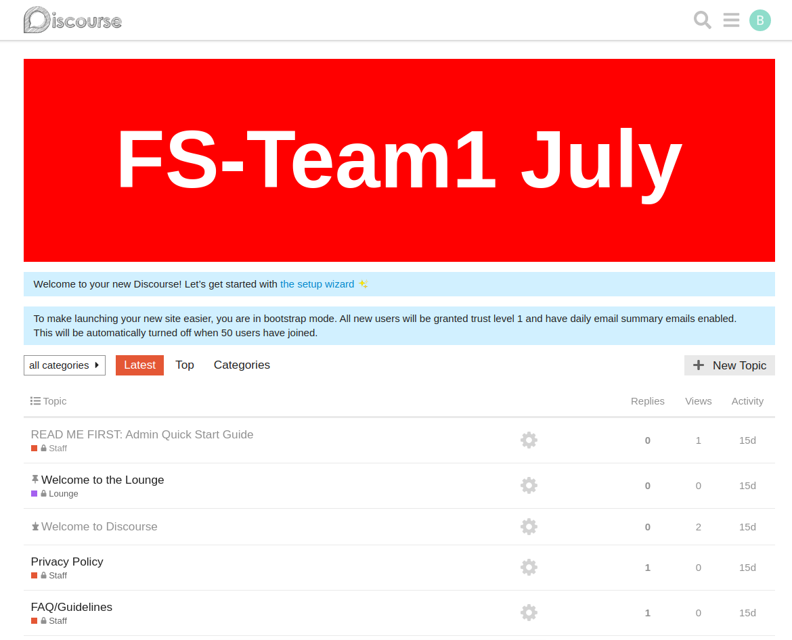

## Introduction
This is the group for FS Team 1.

## Instructions
- You have to be inside `FSTeam1July` directory.
- Always create a branch and work on branch.
- Once you are done, push that branch to GitHub.

## Important
- When starting to work on a new tasks:
- Switch back to master branch like `git checkout master`
- Then do `git pull`
- This will make sure you have latest code available. This will help avoid conflict later.
- Then create a new branch `git checkout -b <branchname>`.
- Work on that branch.


## Instructions to create a simple remote-theme

**STEP**

- Inside folder `FSTeam1July`, create a folder `Remote_Theme` and inside that folder create another folder `username-remote-theme`
- Make sure you have latest code available to avoid conflicts. To check that, you can switch to master branch: `git checkout master`
- Then run `git pull`. It should give you latest code to your local machine.
- Now, create a git branch: `git checkout -b usernameRemoteTheme`

**STEP 2**

- Create a folder `common`
- Inside that folder, create a filename `after_header.html`
- Put this code inside it.

```
<div class="hello-world-banner">
    <h1 class="hello-world">Hello World!</h1>
</div>
```
- Now create a file named: `common.scss` and add following code to it.

```
.hello-world-banner {
    height: 300px;
    width: 100%;
    background: red;
    display: flex;
    align-items: center;
    justify-content: center;
    margin-bottom: 1em;
}

.hello-world {
    font-size: 8em;
    color: white;
}
```

- Next, create `about.json` file inside `username-remote-theme`.
- NOTE: It should not be inside `common` folder. It should be outside of that.
- Add following code to that file:

```
{
    "name": "My first remote theme",
    "about_url": "https://some.url.com",
    "license_url": "https://github.com/GitHubUsername/Remote_Theme/blob/master/LICENSE"
}
```
- Now, push that code to github. Follow the steps to add, commit and push commands. Thats all.
- To avoid complexity, make sure you are on `FSTeam1July` directory before performing git commands.

**ADDITIONAL STEPS**
- If you want to install and preview the theme in your discourse.
- NOTE: SteamAway github is private and we might not have access to genertae OAUTH KEY required to install theme to discourse.
- However, if you create your own personal github repo, you can follow this link to generate OAUTH (only if github repo is private)
`https://thepavilion.io/t/add-a-plugin-theme-or-theme-component-from-a-private-repository-to-discourse/2013`
- Now, just install the theme to your discourse.

## Screenshots


## To be continued...
## To be continued...
## To be continued...
## To be continued...
## To be continued...
## To be continued...
## To be continued...
## To be continued...